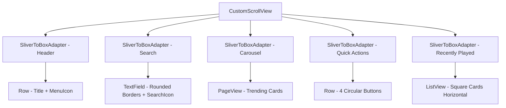

# Plan: Home Screen Layout para The Vinyl Sanctuary

## Objetivo
Crear el layout de la Home Screen con CustomScrollView (Slivers), reorganizando la navegación para incluir Home como primera pestaña.

## Arquitectura
- **Ubicación**: `lib/features/home/presentation/screens/home_screen.dart` (pantalla de contenido)
- **Navegación**: `lib/features/home/presentation/screens/home_navigation_shell.dart` (shell con NavigationBar)
- **Patrón**: Feature-First Clean Room

## Estructura del Layout (CustomScrollView)



## Componentes a Implementar

### 1. Header
- **Widget**: `SliverToBoxAdapter` → `Row`
- **Título**: Text 'Hot Releases' (flavor.text, titleLarge)
- **Icono**: IconButtonM3E con menú (Icons.menu_rounded)
- **Padding**: horizontal 16, vertical 12

### 2. Search Bar
- **Widget**: `SliverToBoxAdapter` → `TextField` con `InputDecoration`
- **Estilo**: border-radius 28, filled true, color surface0
- **Icono**: Icons.search (prefixIcon)
- **Hint**: 'Buscar canciones, artistas...'
- **Padding**: horizontal 16, vertical 8

### 3. Carousel (Trending)
- **Widget**: `SliverToBoxAdapter` → `SizedBox` (height: 220) → `PageView`
- **Tarjetas**: Container con border-radius 20, gradient overlay
- **Contenido**: Imagen + Título + Subtitulo
- **Padding**: vertical 16
- **Efecto**: PageView.builder con indicador de página

### 4. Quick Actions
- **Widget**: `SliverToBoxAdapter` → `Row` (spaceEvenly)
- **Items**: 4 botones circulares
  - Historial: Icons.history_rounded
  - Favoritos: Icons.favorite_rounded
  - Más reproducidas: Icons.trending_up_rounded
  - Shuffle: Icons.shuffle_rounded
- **Estilo**: CircleAvatar (radius: 28) + Text below
- **Padding**: horizontal 24, vertical 16

### 5. Recently Played
- **Widget**: `SliverToBoxAdapter` → Column (title + ListView)
- **Título**: Text 'Recently played' (titleMedium)
- **ListView**: horizontal, height: 160
- **Tarjetas**: Container cuadrado (130x130) + Text debajo
- **Padding**: vertical 16

## Colores (Catppuccin Mocha)
- Background: `flavor.base`
- Surface: `flavor.surface0`
- Primary: `flavor.mauve`
- Text: `flavor.text`
- Subtext: `flavor.subtext1`

## Navegación Actual → Nueva Estructura

### Antes
```
HomeScreen (NavigationBar)
├── LibraryScreen (índice 0)
├── NowPlayingScreen (índice 1)
└── SettingsScreen (índice 2)
```

### Después
```
HomeNavigationShell (NavigationBar)
├── HomeContentScreen (índice 0) ← NUEVO
├── LibraryScreen (índice 1)
├── NowPlayingScreen (índice 2)
└── SettingsScreen (índice 3)
```

## Pasos de Implementación

1. **Crear** `lib/features/home/presentation/screens/home_content_screen.dart`
   - Implementar CustomScrollView con todos los Slivers
   - Usar placeholders de datos (mock data para demo)

2. **Refactorizar** `lib/features/home/presentation/screens/home_screen.dart`
   - Renombrar a `home_navigation_shell.dart`
   - Agregar HomeContentScreen como primera pestaña
   - Actualizar índices de navegación

3. **Actualizar** `main.dart`
   - Importar el nuevo shell de navegación

## Notas
- Usar `const` donde sea posible
- Wrappear widgets complejos en RepaintBoundary si es necesario
- Mantener paddings generosos entre secciones (16-24px)
- Seguir las reglas de nomenclatura del proyecto
