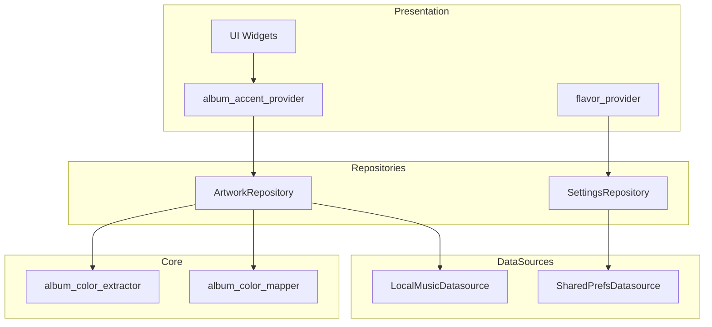

# Plan de Refactorización - Arquitectura Clean

## Visión General



## Archivos a Crear/Modificar

### 1. Nuevos Archivos

#### `lib/features/settings/data/datasources/shared_prefs_datasource.dart`
```dart
// Nuevo datasource para SharedPreferences
class SharedPrefsDatasource {
  final SharedPreferences _prefs;

  Future<Either<Failure, int>> getFlavorIndex() async { ... }
  Future<Either<Failure, void>> setFlavorIndex(int index) async { ... }
}
```

#### `lib/features/settings/data/repositories/settings_repository.dart`
```dart
// Repository que coordina SharedPrefsDatasource
class SettingsRepository {
  final SharedPrefsDatasource _datasource;

  Future<Either<Failure, Flavor>> getFlavor() async { ... }
  Future<Either<Failure, void>> setFlavor(Flavor flavor) async { ... }
}
```

#### `lib/features/library/data/repositories/artwork_repository.dart`
```dart
// Repository que coordina extracción de artwork y colores
class ArtworkRepository {
  final LocalMusicDatasource _datasource;

  // Obtiene artwork de archivo (prioridad 1)
  Future<Either<Failure, Uint8List?>> getArtworkFromFile(String filePath) async { ... }

  // Obtiene colores del artwork (lazy)
  Future<Either<Failure, AlbumColors?>> getAlbumColors(Uint8List bytes, Flavor flavor) async { ... }
}
```

### 2. Archivos a Mover/Refactorizar

| Original | Nuevo | Acción |
|----------|-------|--------|
| `lib/core/utils/album_color_extractor.dart` | `lib/core/theme/utils/album_color_extractor.dart` | Mover |
| `lib/core/utils/album_color_mapper.dart` | `lib/core/theme/utils/album_color_mapper.dart` | Mover |

### 3. Archivos a Modificar

| Archivo | Cambios |
|---------|---------|
| `lib/features/library/data/providers/album_art_provider.dart` | Usar ArtworkRepository via GetIt |
| `lib/features/settings/presentation/providers/flavor_provider.dart` | Usar SettingsRepository via GetIt |
| `lib/features/audio_player/presentation/providers/album_accent_provider.dart` | Consumir ArtworkRepository |
| `lib/core/di/injection_container.dart` | Registrar nuevas dependencias |

## Detalles de Implementación

### AlbumArt Entity (nuevo)
```dart
class AlbumArt {
  final Uint8List? bytes;
  final Color? dominantColor;
  final Color? accentColor;
}
```

### Patrón de Inyección
- Todas las dependencias se registran en `injection_container.dart`
- Providers de Riverpod consumen dependencias via `getIt<>()`

### Lazy Color Extraction
- Colores solo se extraen cuando el track está en el reproductor
- No procesar colores durante el scan inicial de la biblioteca
